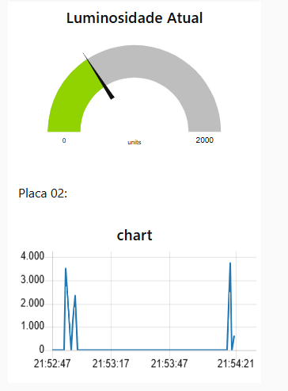
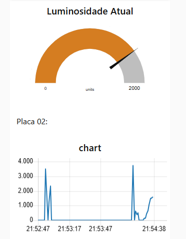

# 💡 LumiConnect - Sensor de Luminosidade IoT com Pico W (BITDOGLAB) e MQTT


Este projeto implementa um dispositivo IoT completo utilizando um Raspberry Pi Pico W e um sensor de luminosidade BH1750. O firmware, desenvolvido em C com o Pico SDK, lê a intensidade da luz ambiente e publica os dados em tempo real para um broker MQTT. A visualização dos dados é feita através de um painel de controle dinâmico no Node-RED.

## 📊 Painel de Controle (Resultado Final)

O painel no Node-RED exibe a luminosidade atual em um medidor (gauge) e o histórico dos dados em um gráfico, atualizados em tempo real.

| Baixa Luminosidade | Alta Luminosidade |
| :---: | :---: |
|  |  |

## ✨ Funcionalidades Principais

* **Leitura de Sensor I2C:** Interface com o sensor de luminosidade BH1750.
* **Conectividade Wi-Fi:** Conexão a uma rede local usando o chip CYW43439 do Pico W.
* **Protocolo MQTT:** Publicação dos dados de telemetria (QoS 1) para um broker MQTT.
* **Arquitetura Modular:** O código é organizado em módulos (main, sensor, mqtt) para maior clareza e manutenibilidade.
* **Sistema Robusto:** Inclui lógica de reconexão automática ao broker MQTT em caso de falha na conexão.
* **Configuração Centralizada:** Todas as configurações (credenciais, IPs, tópicos) estão em um único arquivo `configura_geral.h`.
* **Firmware Otimizado:** Configurações da pilha de rede lwIP ajustadas para garantir estabilidade e evitar erros de alocação de memória.

## 🏗️ Arquitetura do Sistema

O fluxo de dados segue a seguinte arquitetura:

`[Pico W com Sensor BH1750]` -> `[Wi-Fi]` -> `[Broker Mosquitto MQTT]` -> `[Node-RED]` -> `[Painel Web]`

## 🛠️ Hardware e Software Necessários

### Hardware
* Placa com Raspberry Pi Pico W (neste projeto, foi usada a **BitDogLab**)
* Sensor de Luminosidade I2C BH1750

### Software
* [Raspberry Pi Pico C/C++ SDK](https://github.com/raspberrypi/pico-sdk)
* [Mosquitto](https://mosquitto.org/) (ou qualquer outro broker MQTT)
* [Node-RED](https://nodered.org/)
* Um ambiente de compilação C/C++ (GCC para ARM, CMake, etc.)

## 🚀 Como Compilar e Usar

1.  **Clone o Repositório:**
    ```bash
    git clone [URL_DO_SEU_REPOSITÓRIO_AQUI]
    cd LumiConnect
    ```

2.  **Configure o Projeto:**
    * Abra o arquivo `src/configura_geral.h`.
    * Altere as definições `WIFI_SSID` e `WIFI_PASSWORD` com as credenciais da sua rede Wi-Fi.
    * Verifique se o `MQTT_BROKER_IP` corresponde ao endereço IP da máquina onde o Mosquitto está rodando.

3.  **Configure o Ambiente de Build:**
    * Certifique-se de que o Pico C/C++ SDK está instalado e que a variável de ambiente `PICO_SDK_PATH` está definida.

4.  **Compile o Firmware:**
    ```bash
    mkdir build
    cd build
    cmake ..
    make
    ```

5.  **Grave o Firmware:**
    * Pressione e segure o botão `BOOTSEL` no seu Pico W e conecte-o ao computador.
    * Ele aparecerá como um dispositivo de armazenamento USB.
    * Arraste e solte o arquivo `LumiConnect.uf2` (que está na pasta `build`) para dentro do dispositivo. O Pico irá reiniciar e executar o programa.

## 📈 Configuração do Node-RED

1.  Instale e inicie o Node-RED.
2.  Arraste os nós: **`mqtt in`**, **`gauge`**, e **`chart`**.
3.  **Configure o nó `mqtt in`:**
    * **Servidor:** O IP e a porta do seu broker Mosquitto.
    * **Tópico:** `LumiConnect/dados/luminosidade` (ou use o coringa `+/dados/luminosidade`).
    * **Saída:** `uma string`.
4.  Conecte a saída do nó `mqtt in` à entrada dos nós `gauge` e `chart`.
5.  Clique em **Deploy**.
6.  Acesse o painel em `http://SEU_IP_NODERED:1880/ui`.

## 📂 Estrutura dos Arquivos

* **main.c:** Orquestra o projeto, inicializa os módulos e contém o loop principal.
* **bh1750.c / .h:** Módulo do driver para o sensor de luminosidade BH1750.
* **mqtt_lwip.c / .h:** Módulo que encapsula toda a lógica do cliente MQTT.
* **configura_geral.h:** Arquivo central para todas as configurações e credenciais.
* **lwipopts.h:** Configurações avançadas da pilha de rede lwIP para garantir estabilidade.
* **CMakeLists.txt:** Arquivo de build do projeto.

## 🔮 Possíveis Melhorias Futuras

* **Feedback Visual:** Utilizar o LED RGB da placa para indicar o status da conexão (Wi-Fi, MQTT) e publicações.
* **Receber Comandos:** Expandir o módulo MQTT para receber comandos e atuar em outros componentes da placa.
* **Modo de Provisionamento:** Criar um modo de configuração onde o Pico cria um Access Point para que as credenciais de Wi-Fi possam ser inseridas através de uma página web, em vez de estarem fixas no código.

## ✍️ Autor

**[ASCCJR]**
